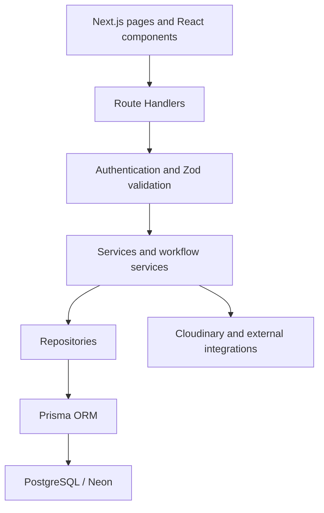

# JobTracker

JobTracker is a full-stack SaaS application for managing job applications and recruitment workflows.

It supports both sides of the hiring process: job seekers can organize their search, documents, interviews, and professional contacts, while recruiters can publish vacancies, manage candidates, schedule interviews, and review hiring analytics.

The project is designed as a production-oriented full-stack application rather than a simple CRUD demo. It focuses on clean architecture, strict authorization, reliable business workflows, localization, and maintainable TypeScript.

> **Status:** Active development. The core job tracking, recruitment, calendar, workspace, notification, and analytics features are implemented. Google/GitHub authentication, Google Meet integration, and browser-based AI are planned.

## Product Overview

### Job Seeker Experience

- Browse and search published vacancies
- Save vacancies to a wishlist
- Apply for positions and track application status
- View upcoming interviews in a personal calendar
- Manage resumes and cover letters
- Preview protected PDF and DOCX documents
- Organize companies and professional contacts
- Create notes, tags, and reminders
- Review personal application statistics
- Receive real-time notifications
- Manage profile information and avatar

### Recruiter Experience

- Create and edit vacancies
- Manage the complete vacancy lifecycle
- Search, sort, filter, archive, and reactivate vacancies
- View candidates for a selected vacancy
- Open candidate profiles and authorized documents
- Move candidates through the recruitment pipeline
- Schedule, reschedule, and cancel interviews
- Review upcoming interviews in a calendar
- Monitor vacancy and candidate metrics
- Analyze hiring funnel performance
- Receive real-time notifications about new applications

## Key Engineering Highlights

### Reliable Interview Lifecycle

Each interview is represented by exactly one `CalendarEvent`, linked to its application through a unique `applicationId`.

This design ensures that:

- scheduling creates one event;
- repeated scheduling updates the same event;
- rescheduling never creates a duplicate;
- recruiters and candidates see the same interview;
- interview events cannot be modified through generic event endpoints;
- cancellation updates the application and calendar atomically;
- personal calendar events remain independent.

### Role and Resource Authorization

The application supports:

- `SEEKER`
- `RECRUITER`
- `ADMIN`

Authorization is enforced for every protected resource. A recruiter can only access candidates, documents, interviews, and statistics belonging to their own vacancies. A seeker can only manage their own applications, documents, workspace data, and calendar events.

### Secure Document Management

- PDF and DOCX support
- 10 MB upload limit
- Authenticated Cloudinary storage
- Short-lived protected access
- Ownership checks before every preview or download
- Recruiter access limited to candidates from their vacancies
- Application-specific document snapshots

### Internationalization

The complete interface supports:

- English
- Polish
- Russian

Navigation, dashboards, forms, dialogs, validation states, notifications, dates, times, numbers, accessibility labels, loading states, and error states are localized.

User-generated content such as vacancy descriptions, company names, notes, and documents is never translated automatically.

## Architecture

JobTracker follows a layered Clean Architecture approach:



Core architectural rules:

- Route Handlers contain no business logic
- Services coordinate business workflows
- Repositories own database access
- Prisma queries never run inside React components
- Request bodies, query parameters, and route parameters are validated with Zod
- Multi-resource business operations use database transactions
- API errors are centralized and sanitized
- TypeScript strict mode is used throughout the project

## Technology Stack

### Frontend

- Next.js 16 App Router
- React 19
- TypeScript
- Tailwind CSS
- shadcn/ui and Radix UI
- TanStack Query
- React Hook Form
- Zod
- Framer Motion
- React Big Calendar
- Recharts
- next-intl
- date-fns

### Backend

- Next.js Route Handlers
- Prisma ORM 7
- PostgreSQL / Neon
- JWT authentication
- Rotating refresh tokens
- HttpOnly cookies
- bcrypt
- Server-Sent Events
- Cloudinary

### Quality

- ESLint
- TypeScript strict mode
- Node test runner with `tsx`
- Unit and service tests
- Repository integration test foundation
- Architecture boundary tests
- Security regression tests
- Localization completeness tests
- Read-only browser smoke tests

## Main Domains

The application is organized around the following domains:

| Domain | Responsibility |
|---|---|
| Authentication | Registration, login, JWT sessions, refresh rotation |
| Vacancies | Creation, publication, closing, archiving, expiration |
| Applications | Applying, status tracking, candidate pipeline |
| Interviews | Scheduling, rescheduling, cancellation, notifications |
| Calendar | Interviews and private custom events |
| Documents | Resumes, cover letters, protected access |
| Workspace | Companies, contacts, notes, tags, reminders |
| Notifications | Persistent notifications and real-time SSE updates |
| Analytics | Seeker statistics and recruiter funnel metrics |
| Localization | Typed English, Polish, and Russian dictionaries |

## Security

Implemented protections include:

- bcrypt password hashing
- One-hour JWT access tokens
- Random refresh tokens stored only as SHA-256 hashes
- Refresh token rotation
- HttpOnly cookies
- Secure cookies in production
- SameSite cookie policy
- Role-based authorization
- Resource ownership validation
- Same-origin protection for mutating API requests
- Zod input validation
- Authentication and upload rate limits
- Content Security Policy
- HSTS in production
- Clickjacking and MIME-sniffing protection
- Centralized API error handling
- Sanitized server logs
- Constant-time admin token comparison

## Testing Strategy

The automated test suite covers:

- access and refresh token behavior;
- session rotation;
- vacancy lifecycle rules;
- interview persistence and duplicate prevention;
- workspace ownership;
- notification formatting;
- route architecture boundaries;
- security headers;
- CSRF and origin validation;
- rate limiting;
- protected download headers;
- localization completeness;
- regression checks for hardcoded user-facing text.

The project quality gate consists of:

```text
npm test
npm run lint
npx tsc --noEmit
npm run build
```

A read-only browser smoke test verifies real Chromium rendering, locale selection, hydration errors, CSP errors, and server failures for English, Polish, and Russian.

## Current Product Status

### Completed

- Seeker and recruiter dashboards
- Vacancy lifecycle management
- Public job discovery
- Application tracking
- Candidate management
- Single-source interview calendar
- Custom calendar event management
- Resume and cover letter storage
- Wishlist
- Companies and contacts
- Notes, tags, and reminders
- Real-time notifications
- Seeker and recruiter analytics
- Full English, Polish, and Russian localization
- API security hardening

### Planned

1. Google and GitHub authentication
2. Separate Google Calendar connection for recruiters
3. Automatic Google Meet creation for interviews
4. Interview duration and external event synchronization
5. Local browser-based AI runtime using WebLLM
6. Versioned AI result history
7. Additional AI features after product validation

Planned integrations are intentionally separated from the completed feature list and are not presented as currently available.

## Product Direction

The long-term goal is to provide a unified workspace for the complete hiring journey:

- job discovery;
- application organization;
- candidate management;
- interview scheduling;
- evidence-based recruiting;
- private, browser-based AI assistance;
- no automatic candidate ranking or autonomous hiring decisions.

AI inference is planned to run locally in the browser through WebGPU. Resume content, vacancy context, and prompts will not be sent to an operator-funded external inference API.

## Project Documentation

- [Development roadmap](ROADMAP.md)
- [Testing notes](docs/testing.md)
- [Calendar implementation report](SESSION_REPORT_20260712.md)
- [Engineering rules](AGENTS.md)

## License

A public license has not been selected yet.
